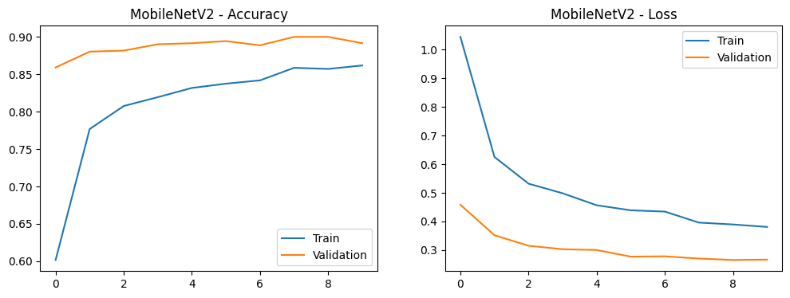
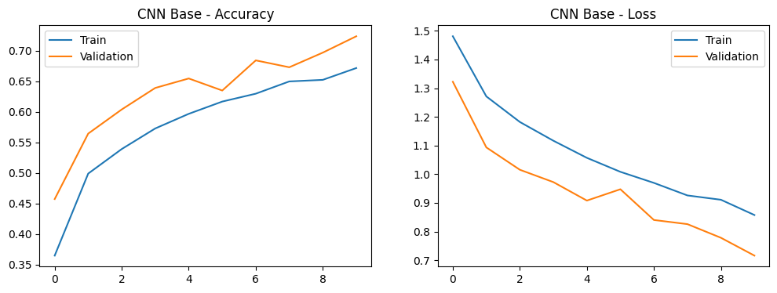
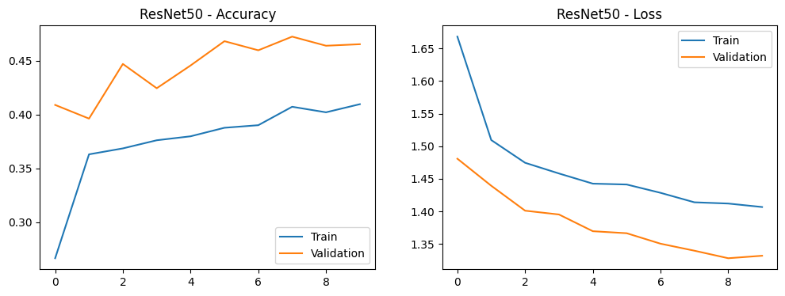
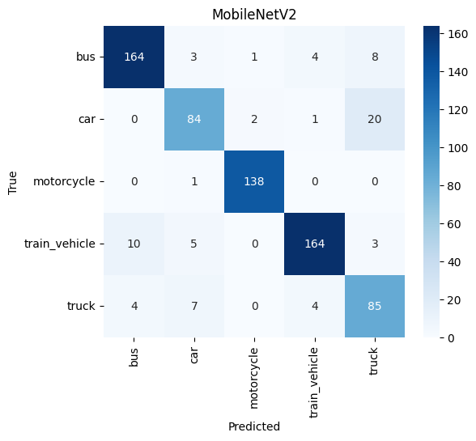
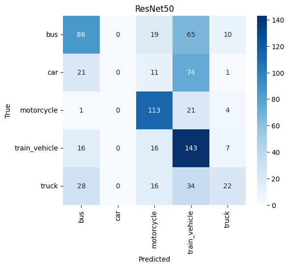
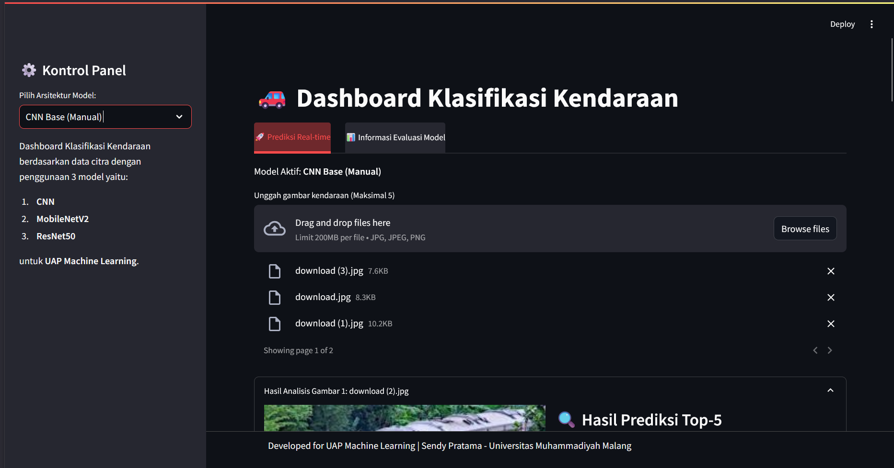
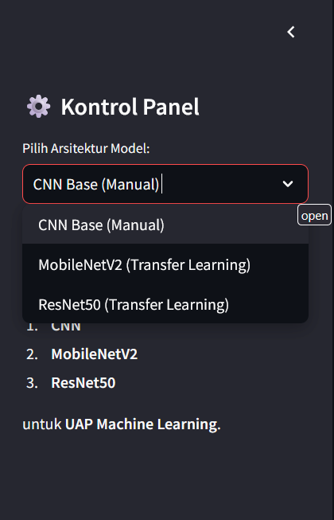
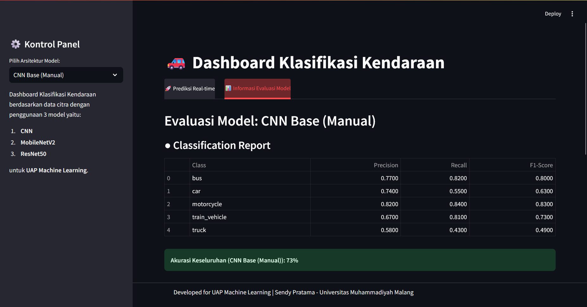

# 🚗 Vehicle Classification Dashboard (UAP Machine Learning)

**Nama:** [Muhammad Sendy Agung Pratama]  
**NIM:** [202210370311022]  
**Kelas:** [Machine Learning C]

---

## 📚 Deskripsi Project 📚
Proyek ini bertujuan untuk mengembangkan sistem klasifikasi kendaraan otomatis berbasis *Computer Vision*. Dengan memanfaatkan teknologi *Deep Learning*, sistem ini mampu mengenali dan membedakan jenis kendaraan melalui input citra digital. Proyek ini membandingkan performa arsitektur CNN manual dengan model *Transfer Learning* (MobileNetV2 dan ResNet50) untuk mendapatkan hasil prediksi yang paling akurat.

### Latar Belakang
Di era transportasi cerdas, identifikasi jenis kendaraan secara otomatis sangat krusial untuk:
* 🚦 **Monitoring Lalu Lintas**: Statistik jumlah kendaraan secara *real-time*.
* 🅿️ **Sistem Parkir Pintar**: Otomatisasi kategori tarif parkir.
* 🛡️ **Keamanan**: Identifikasi kendaraan dalam sistem pengawasan elektronik.

### 🔍 Kategori Klasifikasi: 🔍
Sistem ini mengklasifikasikan 5 jenis kendaraan: **Bus, Car, Motorcycle, Truck, dan Train**.

---

## 📊 Sumber Dataset 📊
Dataset berasal dari Kaggle: [5 Vehicles for Multicategory Classification](https://www.kaggle.com/datasets/mrtontrnok/5-vehichles-for-multicategory-classification) dengan total **6.838 file** citra yang mencakup berbagai sudut pandang dan kondisi cahaya.

---

## 🧑‍💻 Preprocessing dan Pemodelan 🧑‍💻

### Pemilihan Atribut & Transformasi Data
| Proses | Detail Transformasi | Deskripsi |
| :--- | :--- | :--- |
| **Resizing** | 150 x 150 piksel | Menyamakan seluruh dimensi gambar input. |
| **Rescaling** | 1./255 | Normalisasi nilai pixel menjadi rentang 0-1. |
| **Augmentasi** | Horizontal Flip | Menambah variasi data dengan membalik gambar secara horizontal. |
| **Data Split** | 80% Train, 20% Val | Pembagian data untuk pelatihan dan validasi performa. |

### Arsitektur Model
1. **CNN Scratch**: Model manual dengan 3 lapis Conv2D (32, 64, 128 filter) dan Dense layer 512 neuron.
2. **MobileNetV2**: *Transfer Learning* dengan pre-trained weights ImageNet dan Dropout 0.5 untuk mencegah overfitting.
3. **ResNet50**: *Transfer Learning* dengan metode freezing layers pada base model.

---

## 🔍 Hasil dan Analisis 🔍

### Evaluasi Performa Model
| Nama Model | Akurasi (Validation) | Analisis Singkat |
| :--- | :--- | :--- |
| **CNN Scratch** | ~73% | Stabil namun terbatas pada fitur yang sangat kompleks. |
| **MobileNetV2** | **~90%** | **Best Model.** Akurasi tertinggi dan konvergensi tercepat. |
| **ResNet50** | ~51% | Performa kurang optimal pada dataset ini, butuh tuning lebih lanjut. |

### Visualisasi Performa
#### 📈 Learning Curves (Akurasi & Loss)
* **MobileNetV2** 
* **CNN Scratch** 
* **ResNet50** 

#### 🟢 Confusion Matrix
| MobileNetV2 | CNN Scratch | ResNet50 |
| :---: | :---: | :---: |
|  |  |  |

---

## 🎓 Sistem Sederhana Streamlit 🎓
Aplikasi web ini dirancang untuk memberikan antarmuka interaktif dalam melakukan klasifikasi kendaraan.

### Tampilan Dashboard:
1. **Dashboard Utama (Prediksi)**: Area unggah gambar dan penampilan hasil prediksi.  
   

2. **Kontrol Panel (Setting)**: Pengaturan fungsionalitas dan pemilihan parameter sistem.  
    

3. **Sidebar & Info**: Menu navigasi model dan informasi detail pengembang.  
   

---

## 🔧 Langkah Instalasi 🔧
1. **Aktifkan Virtual Environment**:
   ```bash
   source .venv/Scripts/activate  # Windows: .venv\Scripts\activate